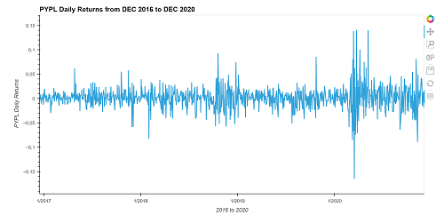
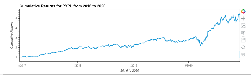
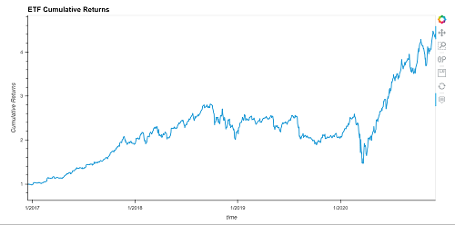

# Exchange_Trade_Fund_Analyzer

The purpose of this repository is to build a financial database and a web application by using SQL, Python and the Viola library to analyze the performance of a hypothetical fintech ETF.

----

## Technologies and Installation Guide

Before running the application first install the following dependencies.

```python
    conda install pandas
    conda install jupyterlab
    conda install -c pyviz hvplot
    pip install sqlalchemy
    conda install -c conda-forge voila
```

----

## Usage

This jupyter notebook consist of analysis of a fintech ETF that consists of four stocks: GOST, GS, PYPL, and SQ. Each stock has its own table in the etf.db database.

Following is the analyze of the daily returns of the ETF stocks both individually and as a whole. 
The detailed instructions are divided into the following parts:

## Analyze a single asset in the ETF



```python
# Create an interactive visualization with hvplot to plot the daily returns for PYPL
pypl_daily_returns_plot = pypl_dataframe.hvplot(
     'time',
    'daily_returns',
    title='PYPL Daily Returns from DEC 2016 to DEC 2020',
    xlabel='2016 to 2020',
    ylabel=' PYPL Daily Returns',
    width=1000,
    height=500
)
pypl_daily_returns_plot
```



## Optimize data access with Advanced SQL queries

For this part we continue to analyze a single asset (PYPL) from the ETF. By using advanced SQL queries to optimize the efficiency of accessing data from the database. We completed the following steps

Access the closing prices for PYPL that are greater than 200

```python
# Write a SQL SELECT statement to select the time and close columns 
# where the PYPL closing price was higher than 200.0.
query = """
SELECT time, close 
FROM PYPL
WHERE
    close > 200.0
"""

# Using the query, read the data from the database into a Pandas DataFrame
pypl_higher_than_200 = pd.read_sql(query, con=engine)

# Converting datetime to date and setting index as a time
pypl_higher_than_200['time'] = pd.to_datetime(pypl_higher_than_200['time']).dt.date
pypl_higher_than_200.set_index('time', inplace = True)

# Review the resulting DataFrame
pypl_higher_than_200
```

Find the top 10 daily returns for PYPL

```python
# Write a SQL SELECT statement to select the time and daily_returns columns
# Sort the results in descending order and return only the top 10 return values
query = """
SELECT time, daily_returns
FROM PYPL
ORDER BY daily_returns DESC
LIMIT 10
"""


# Using the query, read the data from the database into a Pandas DataFrame
pypl_top_10_returns = pd.read_sql(query,con=engine)

# Converting datetime to date and setting index as a time
pypl_top_10_returns['time']=pd.to_datetime(pypl_top_10_returns['time']).dt.date
pypl_top_10_returns.set_index('time', inplace = True)

# Review the resulting DataFrame
pypl_top_10_returns
```

## Analyze the ETF portfolio

```python
# Wreate a SQL query to join each table in the portfolio into a single DataFrame 
# Use the time column from each table as the basis for the join

query = """
SELECT 
GDOT.time,GDOT.daily_returns,
GS.daily_returns, 
PYPL.daily_returns, 
SQ.daily_returns
FROM GDOT
INNER JOIN GS ON  GDOT.time = GS.time
INNER JOIN PYPL ON GDOT.time = PYPL.time
INNER JOIN SQ ON  GDOT.time =SQ.time
"""

# Using the query, read the data from the database into a Pandas DataFrame
etf_portfolio = pd.read_sql(query,con=engine)

# converting datetime to date
etf_portfolio['time']=pd.to_datetime(etf_portfolio['time']).dt.date
etf_portfolio.set_index('time', inplace = True)

# adding columns names
etf_portfolio.columns=['GDOT', 'GS', 'PYPL', 'SQ']

# Review the resulting DataFrame
etf_portfolio
 ```



## Highlight of the notebook as a web application


## Contributors

Amrita Prithiani- amritaprithiani@icloud.com